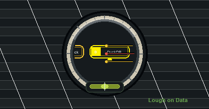

  

<h1 align="center">Lough on Data</h1>

  

  
  
  
  

  

<h3 align="center">Current Coordinates</h3>

  
  
  
  
  
  

<table>
  <tr>
    <td width="50%" valign="top">
      <h3 align="center">Data Stack</h3>
      

        
        
        
        
        
        
        
        
      

    </td>
  </tr>
</table>

  

<h3 align="center">Field Notes</h3>

  
  
  

  

  Data involved in every step downstream of creation.

